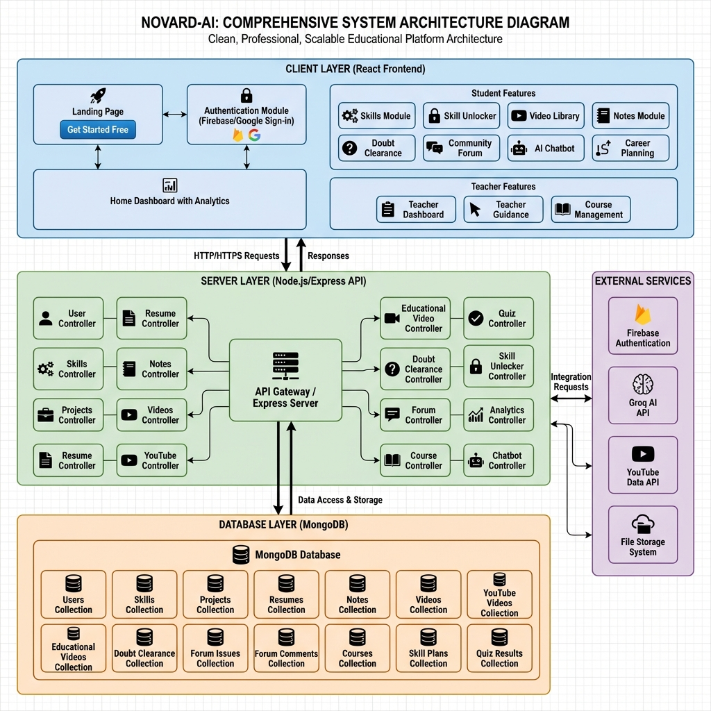

# Novard-AI

**An AI-driven career development and learning platform built on the MERN stack.**

Novard-AI bundles career planning, self-paced learning, document/video comprehension and a community Q&A forum into one application. Nearly every feature is backed by a large language model — Groq (gpt-oss) for text generation and Google Gemini for course discovery — so plans, quizzes, summaries and answers are generated on demand rather than pulled from a fixed catalogue.

<p align="center">
  
</p>

---

## Table of Contents

- [Features](#features)
- [Early warning & admin console](#early-warning--admin-console)
- [Architecture](#architecture)
- [Security](#security)
- [Tech Stack](#tech-stack)
- [Getting Started](#getting-started)
- [Testing, linting and building](#testing-linting-and-building)
- [Environment Variables](#environment-variables)
- [Running with Docker](#running-with-docker)
- [Deploying to Google Cloud Run](#deploying-to-google-cloud-run)
- [API Reference](#api-reference)
- [Data Models](#data-models)
- [Project Structure](#project-structure)
- [Known Gaps](#known-gaps)
- [Contributing](#contributing)
- [License](#license)

---

## Features

### Authentication & profile

Sign-in is **Google OAuth 2.0** through `@react-oauth/google` (implicit flow). The browser sends the Google access token to `POST /api/auth/google`; the API asks Google whether the token is valid, was issued to *this* app's OAuth client and belongs to a verified email, creates the account on first sign-in, and returns a signed **session token** (JWT, 7 days by default). The client keeps it in `localStorage` ([lib/session.js](client/src/lib/session.js)) and sends it as `Authorization: Bearer …` on every request ([lib/api.js](client/src/lib/api.js)); when the API answers 401 the student is signed out. Every application route in [App.js](client/src/App.js) is guarded — unauthenticated visitors are redirected to the landing page. Users can extend their profile with a mobile number and bio from the Profile page.

### Career development hub (`/career`)

Two tools rendered inline in a single workspace:

| Tool | What it does |
| --- | --- |
| **Smart Roadmap** | AI-generated, personalised roadmaps: the student picks a target role, starting level, hours per week, timeline, skills they already have and a goal. The result is a stage-by-stage plan drawn as a Mermaid flow diagram (zoom, full screen, SVG download), with per-topic explanations, tutorial searches, a project per stage and milestones. Every roadmap is saved. The original 12 pre-drawn roadmaps remain as references, each with a one-click "generate a personalised version". |
| **Skill Gap Analysis** | A coaching chatbot. A short intake (target role, current skills, background, hours per week, goal) produces a gap report: the skills the role needs, which ones the student already has, and the missing ones ranked by priority with effort and a first step. The estimated readiness is *computed* from that list (core skills count double). The student then chats with a coach that knows their profile and gaps: short conversational answers by default, full plans when asked, with suggested questions based on their top gaps. Every conversation is saved per student. |


### Skill Unlocker (`/skill-unlocker`)

The most involved module. You describe a skill, a duration (minimum 10 days), your level (beginner/intermediate), focus areas, preferred language and teaching style. The backend then:

1. Prompts gpt-oss-120b for a structured day-by-day JSON curriculum — topic, objective and a suggested video title per day.
2. Searches YouTube for each suggested title via **youtubei.js (Innertube)**, attaching a real `videoId`, title and thumbnail to every day (falling back to a search URL when nothing matches).
3. Persists the plan so progress survives sessions.

From there you can tick days complete, regenerate a single day's video if the match was poor (`refresh-video`), generate a configurable quiz (5–20 questions, beginner/intermediate/advanced) scoped to the days you have actually finished, and keep a history of every quiz attempt with score and completion date.

### Notes: chat with your PDFs (Doubts & Learning → Notes & Quiz)

Upload a PDF (the app accepts files up to 2 MB; the API itself allows 10 MB, and checks the file really is a PDF). The text is extracted with `pdf-parse` v2 (current pdf.js), chunked to fit the model context, and stored. You can then:

- **Chat** with the document — questions are answered from the extracted text, with full chat history retained per note.
- **Summarize** it — long documents are summarized chunk-by-chunk and then consolidated.
- **Generate a quiz** from the content, submit answers, and store a scored result (correct / total / percentage).

### Video Sessions (`/video`)

Two tools behind one page:

- **Video Library** — a request says what you want to learn and your level. The form offers one-click examples. Saving it opens the request and searches straight away: the AI turns the request into 2–3 focused search terms, and YouTube returns the best matches. Placeholder durations and descriptions are hidden on the cards. The app's form uses YouTube. The API also accepts `udemy`, `coursera` and `edureka` for course discovery through **Gemini Flash** (or a built-in course list when no Gemini key is set).
- **Video Summarizer** — paste a YouTube link (watch, youtu.be, Shorts and embed links all work).
  - The title is optional; without one, the video's own YouTube title is used.
  - A preview with the thumbnail appears as soon as the link is valid, and a video you have already added is flagged with an *Open it* button.
  - The caption track (English preferred) is downloaded through Innertube's iOS client and used as the transcript; videos without captions fall back to title + description.
  - Each video then has **Chat** (answers from the transcript), **Summary** (long transcripts are sampled from start to end) and **Quiz** with saved results.

### Doubts & Learning (`/doubts`)

- **Notes & Quiz** — entry point into the notes workflow above.
- **Doubt Clearance** (Doubts & Learning → Doubt Clearance) — describe the doubt (plus an optional screenshot link) and the tutor answers straight away; your question becomes the first message of the chat.
  - The AI writes a short, specific title from the question ([services/doubtTitle.js](server/services/doubtTitle.js)), e.g. "State Remains Old After setCount". The heading and the list show that title with the date and message count, never the description again. `npm run retitle-doubts --prefix server` retitles older doubts and keeps each old title in `previousTitle`.
  - Each doubt has four tabs: **Chat** (follow-up questions), **Summarize** (a structured recap with a flowchart), **Quiz** (after at least two exchanges) and **Videos** (YouTube recommendations picked for the doubt).

### How the learning tools look

Notes & Quiz, Doubt Clearance, Video Summarizer and Video Library share one set of components ([components/learning/](client/src/components/learning/)), so they look and behave the same:

- **One container per item:** a slim heading bar (icon, title, one line of detail, tabs on the right) above the active tab. The list of your items sits on the right.
- **Chat:**
  - a centred reading column;
  - your messages in blue bubbles, the assistant's as plain 16px Markdown beside its avatar;
  - a typing indicator, suggested first questions, and an input box that grows as you type (Enter to send).
- **Waiting on the AI:** summaries, quizzes and video searches show a spinner around the tool's icon, what is happening, how long it usually takes, a live seconds counter and a content skeleton. The tab shows a small spinner too.
- **Quizzes:** lettered answers and an answered-count progress bar. After you submit, you see a score ring and every question marked right or wrong with a "Why" explanation.
- **Adding something new:** a new doubt, video or video request is added through a form in the main area, vertically centred, with a short "how it works" strip. The list button shows when the form is open, and the form opens by itself when you have nothing yet.
- **One palette:** blue for actions and the selected item, neutral greys, and green, amber and red only for status.

### AI Forum (`/forum`)

A Stack Overflow-style Q&A board:

- Every post has a **category** (General, Tutorial, Urgent, Ideation, Showcase) and a separate **status** (Active, Solved, Closed).
- **Category, status, search and sort all combine** on the server: Latest, Most upvoted, Most discussed, Oldest, Title A–Z. Results are paginated, and "Load more" fetches the next page.
- **Only the author can mark a discussion solved, close it, reopen it or delete it.** The server rejects the same request from anyone else with a 403, and deleting a discussion also removes its replies. Closed discussions don't accept new replies.
- **AI participation:** the assistant answers every new discussion and every reply in the background, so posting never waits on the model. Its answers are Markdown (headings, lists, code, tables) and appear nested under the comment they answer, rather than wherever they happen to land in time order.
- Up/down voting on posts and comments.

### Dashboard analytics (`/home`)

[analyticsService.js](server/services/analyticsService.js) turns what the student has actually done into deterministic numbers. These come from quiz answers, skill-plan days completed, questions asked and material studied. The same data always gives the same result:

- **Skill Score** (0–1000) is built from four parts:
  - mastery: quiz accuracy, weighted by recency;
  - progress: skill-plan days completed;
  - consistency: active days in the last 30;
  - breadth: distinct materials studied.

  The dashboard shows the change against the same score a week ago.
- **Quiz accuracy** is weighted by question count and recency. **Plan completion** is the share of plan days completed. The **study streak** follows the student's own timezone.
- **Study time** for the last 7 days is charted. It is the real time spent in the app, recorded by [useStudyTimeTracker](client/src/hooks/useStudyTimeTracker.js) on every page:
  - time counts only while the tab is visible and focused, and while the student has used the mouse, keyboard or touch in the last 5 minutes, or is watching a video;
  - the tracker saves about once a minute, and again when the tab is hidden or closed;
  - the dashboard updates live as time is saved;
  - each day shows the larger of the tracked time and an estimate from saved activity (both are lower bounds on the real time). Days from before tracking existed show only the estimate, drawn lighter and labelled "estimated".
- Every AI chat counts as activity, including the Skill Gap coach and the Novard Agent. Generating a roadmap counts too.
- A **subject proficiency radar** covers the student's own subjects, and a **strengths vs. needs-practice** list covers topics with at least 5 answered questions.

### Profile (`/profile`)

[profileController.js](server/controllers/profileController.js) reuses the same activity model, so the profile and the dashboard always agree. The page shows:

- **Identity card**: photo, name, email, mobile, bio, member-since and last-active date. The current goal comes from the newest skill-gap analysis or roadmap: target role, readiness, weekly hours and skills. The student edits their details inline.
- **Overview tiles**: skill score, quiz accuracy, tests taken, estimated study time, streak, and questions asked across every AI chat.
- **Activity**:
  - the skill score over the last 12 weeks;
  - where study time went, as a donut chart;
  - a 52-week study calendar heatmap;
  - counts of notes, videos, doubts, plans, roadmaps and chats.
- **Tests**: every submitted quiz from Notes, the Video Summarizer, Doubts and skill plans. Includes a score trend, a score spread, accuracy by section and by chosen difficulty, and a filterable history table.
- **Learning path**: skill plans with day progress and the next topic, roadmaps with their stages, and skill-gap analyses with readiness and top gaps.
- **Subject mastery**: the proficiency radar and strengths and weaknesses.

The charts are small SVG components written for this app ([components/profile/charts.jsx](client/src/components/profile/charts.jsx)); no chart library is used.

### Everywhere else

- A floating **Novard Agent** button available across the app (see [Novard Agent](#novard-agent) below).
- **Report a problem** from any AI answer, summary, quiz question, agent or coach message, forum AI reply or roadmap, from the sidebar or from the user menu (with an optional screenshot, voice note or PDF). A **notification bell** in the header and a **My reports** page (`/reports`) show the Novard team's replies and fixes. See [Early warning & admin console](#early-warning--admin-console).
- Markdown rendering (`react-markdown` + GFM, with Mermaid diagrams) for all AI output.
- Tailwind layouts with a persistent sidebar. Every student page is reachable from it:
  - Home, Profile and Settings;
  - Career Development (Smart Roadmap, Skill Gap Analysis);
  - Doubts & Learning (Notes & Quiz, Doubt Clearance);
  - AI Forum;
  - My Learning (Skill Unlocker);
  - Video Sessions (Video Library, Video Summarizer).

  Tools inside a hub can be linked directly with `?tool=` and `?open=<id>` ([lib/openParam.js](client/src/lib/openParam.js)). The old standalone pages were removed. Their URLs (`/roadmap`, `/skills-required`, `/doubt-clearance`, `/notes`, `/youtube-video-summarizer`, `/youtube-videos`) redirect to the same tool inside its hub.

---

## Architecture

```
┌──────────────────────┐        ┌───────────────────────────┐
│  React 18 SPA        │ HTTPS  │  Express API (133 routes) │
│  CRA + Tailwind      │ Bearer │  routes → controllers →   │
│  react-router v6     ├───────►│  services → Mongoose      │
│  Google OAuth (impl.)│ token  │  JWT sessions, rate limits│
└──────────────────────┘        └─────────┬─────────────────┘
                                          │
              ┌───────────────────────────┼──────────────────────────┐
              ▼                           ▼                          ▼
      ┌───────────────┐          ┌─────────────────┐        ┌────────────────┐
      │ MongoDB Atlas │          │ Groq (gpt-oss)  │        │ YouTube        │
      │ 31 collections│          │ Gemini Flash    │        │ (Innertube +   │
      └───────────────┘          └─────────────────┘        │  search API)   │
                                                            └────────────────┘
```

**Model routing.** Every model ID lives in [server/config/ai.js](server/config/ai.js) — the previous IDs were hard-coded in ~30 places and all broke at once when Groq retired the Llama 3.x family.

| Role | Model | Used for |
| --- | --- | --- |
| `MODELS.REASONING` | `openai/gpt-oss-120b` | Curriculum generation, quiz authoring, doubt clearance, forum answers. |
| `MODELS.FAST` | `openai/gpt-oss-20b` | Notes chat, summarization, video Q&A, doubt and chat titles, chat-memory summaries. |
| `MODELS.GEMINI` | `gemini-flash-latest` | Third-party course discovery only. If it is overloaded (503) or rate-limited (429), it is retried once and then `MODELS.GEMINI_FALLBACKS` (default `gemini-flash-lite-latest`; set with `GEMINI_FALLBACK_MODELS`) is used ([ai/gemini.js](server/ai/gemini.js)). |

The early-warning tasks are routed by `route(task, attempt, confidence)` in the same file (report triage and investigation lanes on FAST, root cause on REASONING with more effort on a retry, the verifier on Gemini or another model than the one that wrote the analysis, Whisper for voice notes, `gemini-embedding-001` for report embeddings). Every call in the app, old features included, goes through one model layer ([ai/modelGateway.js](server/ai/modelGateway.js)): it is logged as a `ModelCall` (feature, student, model, tokens, USD from the `PRICING` table, latency, outcome), a model whose **daily** quota is used up fails over to the next (`GROQ_FAILOVER_*`), the per-minute "try again in N s" limit is still waited out, 5xx errors back off, and admins can switch providers and tools off, cap daily spend and set per-student quotas from the console.

Each can be overridden with `GROQ_MODEL_REASONING`, `GROQ_MODEL_FAST` or `GEMINI_MODEL` without touching code (or, at runtime, from the admin console's gateway pages). The gpt-oss models are *reasoning* models: they spend completion tokens on an internal `reasoning` field before emitting `content`, so every Groq call sends `reasoning_effort: "low"` to keep the token budget available for the answer.

**Server layers.** A request passes through [app.js](server/app.js) (security headers, CORS, JSON body limit, global rate limit) to a router in [routes/](server/routes/), which applies `requireAuth()` and, for AI-backed endpoints, the per-student AI rate limit. Controllers in [controllers/](server/controllers/) only translate HTTP: they read the request, take the student's id from the session, call a service and shape the response. Business logic and data access live in [services/](server/services/) (the Novard Agent's in [agent/](server/agent/)), and every error — thrown anywhere — is turned into one JSON format by [middleware/errorHandler.js](server/middleware/errorHandler.js):

```json
{ "error": "A message for the student", "code": "BAD_REQUEST", "details": "optional" }
```

---

## Security

- **Authentication.** Every route except `GET /health`, `GET /`, `POST /api/auth/google`, `GET /api/app-status` (switches and banners, no secrets), `POST /api/admin/auth/google` (checks the role itself) and `POST /api/internal/risk/rescan` (its own `RISK_CRON_SECRET`) requires a valid session token ([middleware/auth.js](server/middleware/auth.js)). Google tokens issued to any other OAuth client are rejected.
- **Authorization.** The student's id always comes from the session. Routes that still carry a user id in the URL or body (kept for compatibility) must match it, or the request is refused with 403. Every read, update and delete of a note, doubt, video, plan, roadmap, analysis or chat is scoped to its owner; forum posts and replies are attributed to the signed-in student, and only the author can change a discussion's status or delete it.
- **Input validation.** Ids must be valid ObjectIds (which also blocks `{"$ne": …}`-style operator injection), text fields are length-bounded, numbers are range-checked, uploads must really be PDFs (the file signature is checked, not just the MIME type), and links that come from model output must be `http(s)`.
- **Rate limiting** ([middleware/rateLimit.js](server/middleware/rateLimit.js)): 300 requests/min per IP, 30 AI requests/min per student, 30 sign-in attempts per 15 min per IP (all configurable).
- **Headers & CORS.** `helmet` sets standard security headers; `CORS_ORIGINS` restricts which sites may call the API. Sessions are bearer tokens, not cookies, so there is no CSRF surface.
- **XSS.** AI output is rendered by `react-markdown` without raw HTML, and Mermaid runs with `securityLevel: 'strict'`.
- **Admin console.** There is one "Continue with Google": when the account is an active admin, `POST /api/auth/google` also returns a separate admin token, so admins reach `/admin` without signing in again (an admin whose admin token expired gets a new one from `POST /api/auth/admin-session` while the app session is valid; `/admin/login` stays as a fallback). Signing out of either signs out of both. The admin token has its own audience and `ADMIN_JWT_EXPIRES_IN` (default 12h). A student token never passes an admin check and vice versa. Every admin request re-reads the role and status from the database, so a demoted or suspended admin loses access on the next request. Only superadmins grant or revoke admin, and the last active superadmin can never be demoted or suspended. Suspended students are signed out on their next request.
- **Audit log.** Every admin change (settings, gateways, users, reports, approvals, announcements, moderation, email reveals, the assistant's confirmed actions) is written to `AdminAuditLog` with who, what, before and after. The console shows it read-only.
- **Secrets.** API keys are never returned by any endpoint; the console shows only whether a key is set and its last four characters. Students' emails are masked in the console; revealing one is audited.

---

## Conversational AI (LangChain)

Every chat in the app runs on one LangChain conversation engine,
[server/ai/conversation.js](server/ai/conversation.js):

| Chat | Memory stored on |
| --- | --- |
| Novard Agent | `ChatbotConversation.messages` (with each message's action cards) |
| Notes | `Notes.chatHistory` |
| Video Summarizer | `YouTubeVideo.chatHistory` |
| Doubt Clearance | `DoubtClearance.chatHistory` |
| Skill-gap coach | `SkillGapSession.messages` |

- **Chain:** `ChatPromptTemplate` (system instructions, `MessagesPlaceholder('history')`, then the new message) piped into `ChatGroq` and a `StringOutputParser`, wrapped in `RunnableWithMessageHistory`.
- **History store:** `MongoChatHistory`, a `BaseListChatMessageHistory` that reads and writes the chat array already stored on each document. Messages are appended with an atomic `$push`, and a turn is saved only after the model answers.
- **Summary-buffer memory:** recent turns go to the model word for word. Once the unsummarised part of a chat passes `MEMORY_SUMMARIZE_AT_TOKENS` (default 10,000), the older turns are folded into a running summary saved in the document's `memory` field, keeping about `MEMORY_KEEP_RECENT_TOKENS` (default 6,000) verbatim. The student can keep asking about anything earlier in the chat, and long chats never overflow the model.
- **Forum:** the AI participant uses the same LangChain pieces with the thread as its history. Human comments are labelled with the author's name, so replies can build on the whole discussion.

- **Rate limits:** Groq's free tier allows about 8,000 tokens per minute per model. When a request is refused with "try again in N s" (up to 30 s), every chat waits and retries automatically. The Novard Agent shows "The AI is busy - continuing in N s…" while it waits. The student never sees a raw provider error.

## Novard Agent

The assistant behind the floating button (`/chatbot`) is an **agent**: it teaches, and it can do things in the app for the student, always after asking.

**Layout.** It is laid out like ChatGPT or Claude:
- **Left:** a sidebar with *New chat* (Ctrl+Shift+O), search, and the chat history grouped by Today, Yesterday, Previous 7 days and so on. Each chat can be renamed or deleted.
- **Centre:** the conversation. Replies stream in word by word, with a Stop button. Assistant messages have a Copy button, and there is a jump-to-latest button when you scroll up.
- **Other touches:** each chat gets an AI-written title, the empty screen offers starter prompts, and on phones the history becomes a drawer.

**How a turn works** ([agent/novardAgent.js](server/agent/novardAgent.js)): it is a LangChain tool-calling loop on `ChatGroq`, with at most 5 model calls per turn.
- **Read tools** run immediately:
  - `get_my_workspace` returns the student's doubts, videos, roadmaps, plans with progress, skill-gap results and recent quiz scores;
  - `search_youtube_videos` searches YouTube.
- **Questions and tasks are handled differently.** Every action has two tools:
  - **A question** ("what is Docker?", "how do I become a DevOps engineer?") gets a full answer plus ONE **suggestion** from a `propose_*` tool. It appears as a card with *Yes* / *No thanks*, and nothing is created until *Yes*. If the model forgets to suggest after a real learning question, one small extra call adds the suggestion (or none, if nothing fits or the student declined it before).
  - **A command** ("create a doubt about…", "fetch me a video on…", "make me a roadmap for…", or "yes" to a suggestion) runs at once with the matching do tool (`create_doubt`, `add_video`, `generate_roadmap`, `create_skill_plan`, `run_skill_gap_analysis`, `post_to_forum`). Commands are recognised in code (a create/add/make… verb plus a doubt/video/roadmap/plan… object, "yes" to a suggestion, or the answer to the agent's clarifying question). For a command:
    - the model is told to do it or ask the one missing detail, and suggestion cards are refused;
    - its text is held back instead of streamed;
    - once the task has run, the reply is a fixed confirmation ("Done! I've created the doubt "…" in Doubt Clearance.") with no further model call. A command never turns into an explanation.
  - **Vague tasks get one question.** "Create a doubt about Docker" makes the agent ask which concept (images, volumes, networking…), then create it from the answer. Only the essential detail is ever asked for: the concept, the role or the skill. Level, hours and timeline are inferred.
  - **A question can never create something by itself.** Do tools are refused unless the student's message, or their previous one, is actually a request (create, add, fetch, make, yes…).
  - **Old suggestions are retired.** When a task is done, any earlier unanswered suggestion of the same kind is marked *Replaced*.

  What each action does:

| Card | What *Yes* does | Opens |
|------|-----------------|-------|
| Save as a doubt | Creates a doubt in Doubt Clearance, already containing the agent's explanation | `/doubts?tool=doubts&open=<id>` |
| Add a video | Adds the chosen YouTube video (from a real search) to Video Summarizer | `/video?tool=summarizer&open=<id>` |
| Generate a career roadmap | Generates a Smart Roadmap for the role, marking skills the student already knows | `/career?tool=roadmap&open=<id>` |
| Create a learning plan | Builds a day-by-day Skill Unlocker plan with a video per day | `/skill-unlocker?open=<id>` |
| Analyse your skill gap | Runs a Skill Gap analysis and opens the coaching chat | `/career?tool=skills&open=<id>` |
| Start a forum discussion | Posts to the AI Forum (the forum AI replies as usual) | `/forum?open=<issueId>` |

- **Same code as the pages:** each action calls the same function the page uses (`createDoubt`, `addYouTubeVideo`, `createRoadmapFor`, `createSkillPlan`, `startSession`, `openIssue`), so an item the agent creates is identical to one made by hand. Cards go from *needs your OK* → *working* → *done* (with an Open button), or *failed* with *Try again*.
- **No duplicates:** a card is claimed atomically, so a double click never creates two items.
- **Memory:** the agent remembers the whole conversation through the same summary-buffer memory as every other chat, including which cards it offered and whether the student accepted or declined them. So "make that roadmap intermediate instead" or "what did you suggest earlier?" work.
- **Safeguards:**
  - the model's arguments are cleaned and bounded, and video ids must come from a real search, never invented;
  - at most 2 proposals per turn;
  - if a reply says "confirm below" without calling a tool, one extra call recovers the card or removes the sentence.

Other pages can open the agent with a question already sent: *Start Mock Interview* (Career) and *Explore New Topics* (Doubts & Learning) do this with `navigate('/chatbot', { state: { prompt } })`.

Routes: see [Novard Agent in the API Reference](#api-reference).

## Early warning & admin console

Students report problems; Novard-AI turns those reports and its own logs into a risk score per area of the app, raises an alert when an area gets worse, can investigate why with a LangGraph pipeline that cites its evidence, and gives admins a console to act. The ideas and algorithms are ported from EWDI (an early-warning system for support tickets); the design and code are Novard's. Full write-up: [docs/early-warning/ARCHITECTURE.md](docs/early-warning/ARCHITECTURE.md).

**Reports.** "Report a problem" opens from every AI answer (with that message attached), the sidebar, the user menu and the Novard Agent (`prepare_report_problem` → an editable draft → Create). A report has a reference (`NV-1A2B3C4D`), an area of the app, text and optionally a screenshot, a Whisper-transcribed voice note (hidden when voice is off) or a PDF; every file is checked by its real bytes. A student may have 2 open reports per area (configurable); the quota is checked before any upload is parsed and held atomically. Each report is triaged right away (area, urgency, sentiment, intent, topic, repeat) in Groq JSON mode; if the model is down the report is still saved and `npm run reports:enrich` catches up. Resolving reports notifies each student exactly once, under the bell.

**Early warning.** Per area and day ([services/earlyWarning/](server/services/earlyWarning/)): report volume, students reporting, unanswered share (48 h after the day), time to first reply, sentiment, urgent share and repeat reporters, plus automatic signals: the AI error and rate-limit rates and latency of the area's features (from the model-call log), AI answers reported per 1,000 calls, and YouTube / PDF failures. Each window (7 days) is compared with its own 21-day baseline using EWDI's robust z (median/MAD, clipped at ±6, signed so positive is always worse); the score is `sigmoid(mean of the top 3 z − 2)` with a per-signal attribution. Levels come from percentiles of the observed scores (P85/P95/P99, never below z = 1.5/3/4.5), or fixed thresholds while history is short. On top of that, the **complaint rule** ([complaints.js](server/services/earlyWarning/complaints.js)) puts an area at risk whenever enough students complain about it, history or not. Each report's text is read as a complaint, a severe complaint (urgent or very negative) or not a risk (a suggestion, praise, mild feedback), using the triage's sentiment, urgency and intent (a word list stands in until the triage has run). Its unresolved complaints of the last 7 days then give 3 → MEDIUM, 5 (or 3 severe) → HIGH and 5 severe → CRITICAL, from at least 2 students. The higher level wins, the board and alerts say "5 complaints in 7 days (3 severe)", and resolving the reports brings the level down on the next board view. Every number is a runtime setting (`risk.complaints`, Features & limits). An alert is raised once per escalation episode (and again if it worsens); a risk object tracks the problem by area and topic (new → ongoing → escalated → resolved → recurring). The scoring functions are tested against outputs of EWDI's own Python ([tests/fixtures/ewdi-golden.json](server/tests/fixtures/ewdi-golden.json)).

**Investigation.** For a HIGH or CRITICAL area, a LangGraph.js graph ([services/earlyWarning/graph/](server/services/earlyWarning/graph/)): a zero-token spine; a supervisor that opens up to five lanes in parallel (trend, peers, history, what students say via Atlas Vector Search or text search, and telemetry: AI provider, YouTube or PDF vs the product); a root cause whose every claim cites report refs, model calls or evidence ids (uncited claims are capped); a verifier on a different model; a what-if outlook by re-scoring; and recommendations. Only flagging the area runs by itself; everything else (a known-issue notice, switching a tool off, rerouting a model, resolving reports, an announcement) waits for an admin's approval and then runs through the console's own control. Budget per run and parallel lanes are capped for Groq's per-minute limits; with no model at all it still ends with a cited, statistics-only answer.

**Admin console** (`/admin`, same look and components as the app): overview, risk board, area and investigation pages, the live investigation (nodes light up over SSE), run history, reports inbox, gateways (Groq, Gemini, YouTube, Google sign-in, MongoDB: health, spend, settings, a Test button; API keys are never shown), users, moderation, features & limits (every runtime setting: tool switches, maintenance, rate limits, quotas, areas, thresholds, budgets, model routes), announcements, the admin assistant and the audit log. Runtime settings are stored in MongoDB and layered DB > env > default, cached 30 s per instance.

**Admin assistant.** The Novard Agent's engine with admin-only tools: it reads the live platform (risk board, areas, reports, search, gateways, costs, runs, findings, users) and proposes investigations, report resolutions, tool switches and model routes as confirmation cards. It must look live data up before answering, every figure must come from a tool result, and it refuses to touch API keys, admin roles or account suspensions.

**Become superadmin and run the demo:**

```bash
# 1. Make yourself superadmin (either one)
#    - put SUPERADMIN_EMAILS=you@gmail.com in server/.env, restart the API and sign in once, or
npm run admin:grant --prefix server -- --email you@gmail.com --role superadmin

# 2. Seed a genuine incident in one area (a quiet baseline everywhere, then a spike)
npm run risk:seed-demo --prefix server -- --area video-summarizer --student you@gmail.com
```

Then sign in to the app as `you@gmail.com` and open **Admin console** from the sidebar (or go to `/admin`) → the risk board shows Video Summarizer at CRITICAL → open it → **Run investigation** and watch the live view → on the findings page approve "known issue notice" (students of that tool now see it; the audit log has the change) → resolve the area's reports with a note (Reports inbox, or approve the recommendation) → back in the app, the bell shows one notification. `npm run risk:seed-demo --prefix server -- --clear` removes everything the demo created.

**Scripts:** `admin:grant`, `risk:score` (features → scores → alerts → lifecycle; idempotent), `reports:enrich` and `reports:embed` (resumable batch passes), `db:vector-index` (creates or updates the Atlas Vector Search index; says so if the cluster has no Atlas Search), `risk:seed-demo`.

---

## Personalised roadmaps

[server/services/roadmapService.js](server/services/roadmapService.js) asks the model for a
**structured** roadmap (stages, then topics, then a project for each stage), never for Mermaid.
The server then:
- validates the result: 4–7 stages, 3–6 topics each, and any stage with too few topics is dropped;
- rescales stage lengths to the timeline the student chose;
- marks topics the student already knows, using whole-word matching (knowing "C" does not mark "CSS");
- builds the diagram in code (`buildRoadmapMermaid`), so it is always valid Mermaid with a consistent layout: start, one row per stage, then goal. Core topics are blue, optional ones dashed, already-known ones green, and projects magenta.

The diagram is rebuilt every time a roadmap is read, so styling changes apply to older
roadmaps too. Resources are YouTube *search* links built from model-suggested queries, not
URLs written by the model, which can be invented.

Routes: see *Skill Unlocker, career tools, analytics* in the [API Reference](#api-reference).

## Skill-gap coach

[server/services/skillGapService.js](server/services/skillGapService.js) makes one structured call
to list the skills the target role needs and mark which ones the student already has. A skill the
student listed always counts as held (whole-word match), even if the model misses it. Readiness is
then calculated from that list rather than taken from the model. The opening chat message is built
from the analysis, so it costs no extra model call.

Every reply after that is grounded in the student's profile and gaps. Replies are short and
conversational by default and switch to structured Markdown only when the student asks for a plan
or a comparison.

Sessions are stored per student in `SkillGapSession` (routes in the [API Reference](#api-reference)).

## Customised quizzes

Every quiz — Notes, Video Summarizer, Doubt Clearance and Skill Unlocker — starts from
the same setup screen ([QuizSetup.jsx](client/src/components/quiz/QuizSetup.jsx)):

- **Your previous marks on this topic:** attempts, best, average and latest (with the
  change since the one before), plus each past attempt with its date, score and the
  settings it used. Only quizzes that were actually submitted count, following the
  same rules as the dashboard.
- **Options:** difficulty (Beginner / Intermediate / Advanced), number of questions
  (5, 10, 15, 20 or any value from 5 to 20), question style (Conceptual / Practical /
  Mixed), and an optional focus sub-topic. These start from the student's last choices
  on that topic.

All four sections generate through one service
([server/services/quizService.js](server/services/quizService.js)). It:

- returns exactly the number of questions asked for, with a follow-up request if the
  model returns too few;
- validates every question (4 distinct options, one correct answer, an explanation);
- shuffles the options, because models put the answer in the first two positions far
  more often than chance;
- samples long documents from start to end instead of reading only the first chunk.

Past marks come from `GET /api/quiz-history/:source/:itemId`.

## How summaries and chat replies are rendered

Every piece of model output in the app — summaries, chat replies, forum answers and the
Novard Agent's and skill-gap coach's messages — is rendered by one component,
[`MarkdownView`](client/src/components/MarkdownView.jsx): `react-markdown` with
`remark-gfm` for tables, task lists and strikethrough.

Summary prompts additionally require **one Mermaid flowchart** per summary. The rules
live in [server/config/prompts.js](server/config/prompts.js) and are deliberately
strict, because models break the Mermaid parser in the same few ways every time
(unquoted labels containing punctuation, the reserved word `end` used as a node id).
A ```mermaid fence is rendered as an SVG by
[`MermaidDiagram`](client/src/components/MermaidDiagram.jsx), which imports mermaid
on demand so the ~480 kB library never enters the initial bundle. It waits (up to 1.5 s)
for the page font before drawing, so node labels are measured in the font they are shown
in and are never clipped. If a model does emit an invalid diagram, that block falls back
to a plain code block rather than taking the summary down with it.

This replaced three separate approaches: raw `{summary}` text (which showed `###` and
`**` literally), a sentence-splitting card builder that destroyed tables and lists, and
`StructuredMessageRenderer` — a ~180-line regex parser duplicated across three files
with no table support. `dangerouslySetInnerHTML` no longer appears anywhere in the
client; react-markdown is configured without `rehype-raw`, so raw HTML in model output
is inert text rather than something that has to be sanitised.

## Tech Stack

**Frontend** — React 18.3, React Router 6 (route-level code splitting), `@react-oauth/google`, Axios, Tailwind CSS 3 + `@tailwindcss/typography`, `react-markdown` + `remark-gfm`, `mermaid` (lazy-loaded), `react-icons`, Create React App (`react-scripts` 5).

**Backend** — Node.js 20, Express 4, Mongoose 8, LangChain (`@langchain/core`, `@langchain/groq`, `@langchain/langgraph` for the risk investigation graph), `groq-sdk` (chat and Whisper), `@google/generative-ai`, `youtubei.js`, `youtube-search-api`, `pdf-parse`, Multer, `jsonwebtoken`, `helmet`, `express-rate-limit`, CORS.

**Quality** — Jest + Supertest + `mongodb-memory-server` (server), Jest + React Testing Library (client), ESLint on both.

**Infrastructure** — MongoDB Atlas (with Atlas Vector Search for report embeddings; `mongodb-atlas-local` in Docker), Docker + Docker Compose, Nginx (client image), Google Cloud Run + Artifact Registry + Cloud Build, Vercel (client-only SPA deploy via [vercel.json](vercel.json)).

---

## Getting Started

### Prerequisites

- Node.js 20.16+ (the server uses `pdf-parse`, which needs it)
- A MongoDB instance (Atlas connection string, or local/Docker MongoDB)
- A [Groq API key](https://console.groq.com)
- A Google OAuth 2.0 Client ID (Web application) with your dev origin (`http://localhost:3000`) in its **Authorized JavaScript origins**
- Optional: a Google AI (Gemini) API key — used only for Udemy/Coursera/Edureka course discovery

### Install

```bash
git clone <your-fork-url> novard-ai
cd novard-ai
npm run install:all          # installs server/ and client/
```

### Configure

```bash
cp server/.env.example server/.env
cp client/.env.example client/.env
```

Then fill in at least `MONGO_URI`, `GROQ_API_KEY`, `GOOGLE_CLIENT_ID` and `JWT_SECRET` in `server/.env`, and `REACT_APP_API_ENDPOINT` and `REACT_APP_GOOGLE_CLIENT_ID` in `client/.env`. `GOOGLE_CLIENT_ID` (server) and `REACT_APP_GOOGLE_CLIENT_ID` (client) must be the same value. Generate a `JWT_SECRET` with:

```bash
node -e "console.log(require('crypto').randomBytes(48).toString('hex'))"
```

### Run

```bash
# Terminal 1 — API on :5000 (restarts on file changes)
npm run dev:server

# Terminal 2 — React dev server on :3000
npm run dev:client
```

Open <http://localhost:3000>. `GET /health` reports `{ "status": "OK", "database": "up" }` when the API and its database are ready. Use `npm start --prefix server` to run the API without file watching.

---

## Testing, linting and building

| Command (from the repo root) | What it does |
| --- | --- |
| `npm test` | Server tests, then client tests. |
| `npm test --prefix server` | Unit + API tests. Each API test file runs against its own in-memory MongoDB; the AI providers and YouTube are mocked, so no keys or network are needed. The first run downloads a MongoDB binary (~120 MB). |
| `npm run test:coverage --prefix server` | The same, with a coverage report. |
| `npm run test:ci --prefix client` | Client tests once (use `npm test --prefix client` for watch mode). |
| `npm run lint` | ESLint on server and client. |
| `npm run build` | Production build of the client into `client/build/`. |

The server test suites cover every endpoint's authentication, ownership and validation rules, each feature's workflow (notes, doubts, videos, video library, forum, learning plans, roadmaps, skill-gap coach, analytics, profile, study time, the Novard Agent's turn loop and action cards) and the business logic behind them (quiz validation, analytics scoring, roadmap and readiness maths, transcript parsing, JSON recovery from model output).

---

## Environment Variables

### Server

See [server/.env.example](server/.env.example) for a commented template.

| Variable | Required | Purpose |
| --- | --- | --- |
| `MONGO_URI` | yes | MongoDB connection string. |
| `GROQ_API_KEY` | yes | Powers every Groq-backed feature. |
| `GOOGLE_CLIENT_ID` | yes | Google OAuth client ID(s), comma-separated, whose sign-ins the API accepts. Same value as the client's `REACT_APP_GOOGLE_CLIENT_ID`. |
| `JWT_SECRET` | yes in production | Signs session tokens. In development a random secret is used when unset (everyone is signed out on restart). Changing it signs everyone out. |
| `GOOGLE_API_KEY` / `GEMINI_API_KEY` | optional | Gemini, used only for Udemy/Coursera/Edureka course discovery; without it the built-in course list is used. |
| `PORT` | no | Defaults to `5000`; container images default to `8080`. |
| `NODE_ENV` | no | `production` enables JSON logs and `TRUST_PROXY=1`, and makes `JWT_SECRET` mandatory. |
| `JWT_EXPIRES_IN` | no | Session lifetime, default `7d`. |
| `CORS_ORIGINS` | no | Comma-separated browser origins allowed to call the API. Unset = any origin (a warning is logged in production). |
| `TRUST_PROXY` | no | Proxy hops in front of the API (default `1` in production), so rate limits see the real client IP. |
| `UPLOAD_DIR` | no | Where uploaded PDFs are stored, relative to `server/` (default `uploads`). |
| `RATE_LIMIT_API_PER_MINUTE` / `RATE_LIMIT_AI_PER_MINUTE` / `RATE_LIMIT_AUTH_PER_15_MIN` | no | Rate limits (defaults 300 / 30 / 30). |
| `LOG_LEVEL` / `LOG_FORMAT` | no | `error`, `warn`, `info`, `debug` or `silent`; `LOG_FORMAT=json` forces JSON lines. |
| `GROQ_MODEL_REASONING`, `GROQ_MODEL_FAST`, `GEMINI_MODEL`, `GEMINI_FALLBACK_MODELS` | no | Model overrides (see [config/ai.js](server/config/ai.js)). |
| `MEMORY_SUMMARIZE_AT_TOKENS`, `MEMORY_KEEP_RECENT_TOKENS` | no | When chat memory is summarised (see [Conversational AI](#conversational-ai-langchain)). |
| `SUPERADMIN_EMAILS` | no | Comma-separated accounts that become superadmin when they sign in (the easiest way to create the first admin). |
| `ADMIN_JWT_EXPIRES_IN` | no | Admin console session lifetime, default `12h`. |
| `RATE_LIMIT_ADMIN_AUTH_PER_15_MIN` | no | Admin sign-in attempts per IP (default 10). |
| `RISK_CRON_SECRET` | no | Shared secret for Cloud Scheduler's `POST /api/internal/risk/rescan` (header `X-Risk-Cron-Secret`). Unset = that endpoint is off. |
| `SETTINGS_CACHE_MS` | no | How long each instance caches runtime settings (default 30000). |
| `GROQ_FAILOVER_REASONING`, `GROQ_FAILOVER_FAST` | no | Models to try, in order, when one has used up its daily quota. |
| `GROQ_TRANSCRIBE_MODEL` | no | Whisper model for voice notes on reports (default `whisper-large-v3-turbo`). Voice is hidden when Groq is not available. |
| `GEMINI_EMBED_MODEL`, `EMBED_DIM` | no | Report embeddings (default `gemini-embedding-001`, 768 dimensions). Without a Gemini key, semantic search falls back to MongoDB text search and topics to the triage intent. |
| `VECTOR_SEARCH` | no | `auto` (default: use Atlas Vector Search when the cluster has it), `on` or `off`. Create the index with `npm run db:vector-index`. |
| `MODEL_CALL_RETENTION_DAYS` | no | Days model-call and gateway logs are kept (default 45; the risk features need 28). |

> The server refuses to start if `MONGO_URI`, `GROQ_API_KEY`, `GOOGLE_CLIENT_ID` or (in production) `JWT_SECRET` is missing.

### Client

Create React App inlines `REACT_APP_*` values **at build time**, not at runtime — a container must be rebuilt (or built with the right `--build-arg`) to change them. Template: [client/.env.example](client/.env.example).

| Variable | Required | Purpose |
| --- | --- | --- |
| `REACT_APP_API_ENDPOINT` | yes | Base URL of the Express API. |
| `REACT_APP_GOOGLE_CLIENT_ID` | yes | Google OAuth 2.0 Web client ID. |

---

## Running with Docker

The development stack ([docker-compose.yml](docker-compose.yml)) brings up three containers — MongoDB (the `mongodb/mongodb-atlas-local` image, so report vector search works locally too), the API, and the React build served by Nginx:

```bash
export REACT_APP_GOOGLE_CLIENT_ID=your_google_client_id
docker compose up --build
```

- Client → <http://localhost:3000>
- API → <http://localhost:5001>
- MongoDB → `localhost:27018` (use `?directConnection=true`; persisted in the `mongodb_atlas_data` / `mongodb_atlas_config` volumes). Coming from the old `mongo:7.0` container? Its volume is kept; copy your data across with the two commands in [DOCKER_SETUP.md](DOCKER_SETUP.md#moving-your-data-from-the-old-mongo70-container).

Both services declare health checks, and `server/uploads` is bind-mounted so uploaded PDFs survive container restarts.

To smoke-test the production images against an external Atlas cluster, use [docker-compose.prod.yml](docker-compose.prod.yml) — it drops the MongoDB container and reads credentials (including `JWT_SECRET`) from your shell. Full details in [DOCKER_SETUP.md](DOCKER_SETUP.md).

The server image runs as the unprivileged `node` user with `NODE_ENV=production`; only `/app/uploads` is writable.

---

## Deploying to Google Cloud Run

[deploy.sh](deploy.sh) automates the whole path: it authenticates, enables the Cloud Run / Artifact Registry / Cloud Build APIs, creates the registry repo, builds and pushes both images, deploys the server (with `MONGO_URI`, `GROQ_API_KEY`, `GOOGLE_API_KEY` and `JWT_SECRET` from `server/.env`, and `GOOGLE_CLIENT_ID` from `client/.env`), reads back its URL, rebuilds the client with that URL baked in, deploys the client, and finally sets the server's `CORS_ORIGINS` to the client URL.

```bash
export GCP_PROJECT_ID=your-project-id
export GCP_REGION=asia-south1   # optional, this is the default
./deploy.sh
```

The client image is a two-stage build (Node build → Nginx) whose config template is expanded with the `PORT` Cloud Run injects. [cloudbuild.yaml](cloudbuild.yaml) covers CI-triggered builds; it only *updates* `NODE_ENV`, `GOOGLE_CLIENT_ID` and `CORS_ORIGINS` (set `_CLIENT_URL`), so set `MONGO_URI`, `GROQ_API_KEY`, `GOOGLE_API_KEY` and `JWT_SECRET` on the service once — ideally as Secret Manager references. Step-by-step manual instructions and troubleshooting live in [CLOUD_RUN_SETUP.md](CLOUD_RUN_SETUP.md).

Remember to add your deployed client URL to the **Authorized JavaScript origins** of your Google OAuth client.

**Risk scoring on a schedule.** Cloud Run scales to zero, so nothing runs on a timer inside the app. Set `RISK_CRON_SECRET` on the server and create a Cloud Scheduler job that calls `POST /api/internal/risk/rescan` hourly with that secret in the `X-Risk-Cron-Secret` header; `deploy.sh` does this when `RISK_CRON_SECRET` is set (see [CLOUD_RUN_SETUP.md](CLOUD_RUN_SETUP.md#risk-scoring-schedule-optional)). Without it, scores are refreshed when an admin opens the risk board and they are over an hour old. Investigations run in the background after `POST …/assess` returns: keep the console's live view open while one runs, or deploy the server with `--no-cpu-throttling` so they finish unattended.

---

## API Reference

Routes live in [server/routes/](server/routes/) (132 in total, 65 of them for reports, notifications and the admin console). Base URL is `REACT_APP_API_ENDPOINT`. Except where marked *public*, every route needs `Authorization: Bearer <session token>`; the `:userId` path segments and `userId` body fields that some routes still accept must be the signed-in student's email. Errors use the format shown under [Architecture](#architecture); AI-backed routes (marked **AI**) share a per-student rate limit.

<details>
<summary><b>Health, sign-in & account</b></summary>

| Method | Path | Description |
| --- | --- | --- |
| `GET` | `/health` | *Public.* Liveness probe; reports whether the database is connected. |
| `GET` | `/` | *Public.* Plain-text banner. |
| `POST` | `/api/auth/google` | *Public.* `{accessToken}` from Google → `{token, user}`, plus `admin: {token, admin}` when the account is an active admin. Creates the account on first sign-in. |
| `GET` | `/api/auth/me` | The signed-in student's account. |
| `POST` | `/api/auth/admin-session` | An admin's app session → `{token, admin}` for the console (role and status re-read; 403 `NOT_ADMIN` otherwise). |
| `POST` | `/updateUserProfile` | `{name?, mobile?, bio?}` → `{success, user, token}` (a fresh token carrying the new name). |

</details>

<details>
<summary><b>Notes</b></summary>

| Method | Path | Description |
| --- | --- | --- |
| `POST` | `/upload-notes` | **AI.** Multipart PDF upload (field `pdf`, 10 MB max) → 201 with the new note. |
| `GET` | `/notes/:userId` | The student's notes (without extracted text). |
| `POST` | `/chat-with-notes` | **AI.** `{noteId, message}` — answer grounded in the note. |
| `POST` | `/summarize-notes` | **AI.** `{noteId}` — chunked summarization. |
| `POST` | `/generate-quiz` | **AI.** `{noteId, difficulty?, questionCount?, style?, focus?}`. |
| `POST` | `/save-quiz-results` | `{noteId, quizId, userAnswers, score: {correct, total}}`. |
| `DELETE` | `/notes/:noteId` | Delete a note and its file. |

</details>

<details>
<summary><b>Video library & summarizer</b></summary>

| Method | Path | Description |
| --- | --- | --- |
| `GET` | `/educational-video-requests/:userId` | The student's learning requests. |
| `POST` | `/educational-video-requests` | `{title, description, platform?}` → 201. |
| `DELETE` | `/educational-video-requests/:videoRequestId` | Delete a request. |
| `POST` | `/recommend-educational-videos` | **AI.** `{title, description, platform?}` → `{videos}`. |
| `POST` | `/youtube-videos` | **AI.** `{videoUrl, title?}` → 201; fetches metadata and captions. Without a title, the video's own YouTube title is used. |
| `GET` | `/youtube-videos/:userId` | The student's videos (without transcripts). |
| `POST` | `/chat-with-youtube-video` | **AI.** `{videoId, message}`. |
| `POST` | `/summarize-youtube-video` | **AI.** `{videoId}` (cached after the first run). |
| `POST` | `/generate-youtube-quiz` | **AI.** `{videoId, …quiz options}` → `{quiz, quizIndex}`. |
| `POST` | `/save-youtube-quiz-results` | `{videoId, quizIndex, score}` (number correct). |
| `DELETE` | `/youtube-videos/:videoId` | Delete a video. |

</details>

<details>
<summary><b>Doubt clearance</b></summary>

| Method | Path | Description |
| --- | --- | --- |
| `GET` | `/doubt-clearances/:userId` | The student's doubts. |
| `POST` | `/doubt-clearances` | **AI.** `{description, title?, imageUrl?}` → 201 (title written by the AI). |
| `POST` | `/chat-with-doubt-clearance` | **AI.** `{doubtId, message}`. |
| `POST` | `/summarize-doubt-clearance` | **AI.** `{doubtId}` (cached after the first run). |
| `POST` | `/generate-doubt-quiz` | **AI.** `{doubtId, …quiz options}`; needs two exchanges in the chat. |
| `POST` | `/save-doubt-quiz-results` | `{doubtId, quizIndex, score}`. |
| `POST` | `/get-youtube-recommendations` | **AI.** `{doubtId}` → up to 6 videos. |
| `DELETE` | `/doubt-clearances/:doubtId` | Delete a doubt. |

</details>

<details>
<summary><b>Forum</b></summary>

| Method | Path | Description |
| --- | --- | --- |
| `POST` | `/api/forum/issues` | **AI.** `{title, description, category?, tags?}` → 201; the AI's first answer follows in the background. |
| `GET` | `/api/forum/issues` | `?category= &status= &q= &sort= &page= &limit=` |
| `GET` | `/api/forum/issues/:issueId` | One discussion. |
| `PUT` | `/api/forum/issues/:issueId/status` | Author only. `{status: open\|resolved\|closed}`. |
| `DELETE` | `/api/forum/issues/:issueId` | Author only; removes every reply. |
| `GET` | `/api/forum/issues/:issueId/comments` | Replies, oldest first. |
| `POST` | `/api/forum/comments` | **AI.** `{issueId, content, parentCommentId?}` → 201; the AI replies in the background. |
| `POST` | `/api/forum/comments/:commentId/ai-response` | **AI.** An AI reply to one comment. |

</details>

<details>
<summary><b>Skill Unlocker, career tools, analytics</b></summary>

| Method | Path | Description |
| --- | --- | --- |
| `POST` | `/api/skill-unlocker/generate-plan` | **AI.** `{skillName, duration (10-60), description, preferences?}` → 201. |
| `GET` | `/api/skill-unlocker/plans/:userId` | The student's plans with progress. |
| `POST` | `/api/skill-unlocker/toggle-day-completion` | `{planId, dayNumber}`. |
| `POST` | `/api/skill-unlocker/refresh-video` | **AI.** `{planId, dayNumber}` — another video for that day. |
| `POST` | `/api/skill-unlocker/generate-quiz` | **AI.** Quiz on the completed days. |
| `POST` | `/api/skill-unlocker/save-quiz-result` | `{planId, quizId, score (0-100), totalQuestions, …}`. |
| `DELETE` | `/api/skill-unlocker/plans/:planId` | Delete a plan. |
| `POST` | `/api/roadmaps/generate` | **AI.** `{role, level?, hoursPerWeek?, timelineMonths?, knownSkills?, goal?}` → 201. |
| `GET` | `/api/roadmaps/user/:userId`, `/api/roadmaps/:id` | List / open (with its Mermaid diagram). |
| `DELETE` | `/api/roadmaps/:id` | Delete a roadmap. |
| `POST` | `/api/skill-gap/sessions` | **AI.** `{targetRole, currentSkills?, experience?, hoursPerWeek?, goal?}` → 201. |
| `GET` | `/api/skill-gap/sessions/user/:userId`, `/api/skill-gap/sessions/:id` | List / open. |
| `POST` | `/api/skill-gap/sessions/:id/messages` | **AI.** `{message}` → `{userMessage, assistantMessage}`. |
| `DELETE` | `/api/skill-gap/sessions/:id` | Delete an analysis. |
| `GET` | `/api/analytics/:userId` | Dashboard analytics (`?tzOffset=` minutes). |
| `GET` | `/api/profile/:userId/overview` | Profile page data (`?tzOffset=`). |
| `GET` | `/api/quiz-history/:source/:itemId` | Previous marks; `source` is `notes`, `youtube`, `doubt` or `plan`. |
| `POST` | `/api/usage/heartbeat` | Study time: `{day: "YYYY-MM-DD", seconds}`. `text/plain` bodies (from `sendBeacon`) may carry `token` instead of the header. Capped at 5 minutes per call and 24 hours per day. |

</details>

<details>
<summary><b>Novard Agent</b></summary>

| Method | Path | Description |
| --- | --- | --- |
| `POST` | `/api/agent/chat` | **AI.** `{message, conversationId?}` → Server-Sent Events: `meta`, `token`, `status`, `action`, `superseded`, `title`, `done`, `error`. |
| `POST` | `/api/agent/conversations/:id/actions/:actionId` | **AI.** `{decision: confirm\|dismiss}` → `{action}`. |
| `GET` | `/api/agent/conversations/user/:userId`, `/api/agent/conversations/:id` | List / open chats. |
| `PATCH` | `/api/agent/conversations/:id` | `{title}`. |
| `DELETE` | `/api/agent/conversations/:id` | Delete a chat. |

</details>

<details>
<summary><b>Reports, notifications and app status</b></summary>

| Method | Path | Description |
| --- | --- | --- |
| `POST` | `/api/reports?area=` | **AI.** Multipart: `text` (10-4,000 chars), `source` (JSON: page, tool, itemType, itemId, messageIndex, excerpt), optional `screenshot`, `voice`, `pdf`. The open-report quota (2 per area) is checked **before** the upload is parsed → 429 `REPORT_QUOTA`. → 201 `{ref: "NV-XXXXXXXX", …}`. |
| `GET` | `/api/reports/mine`, `/api/reports/:ref` | The student's own reports (public notes only). |
| `POST` | `/api/reports/:ref/notes` | `{body}`: add to a report; reopens a resolved one. |
| `GET` | `/api/reports/:ref/attachments/:n` | An attachment of the student's own report. |
| `GET` | `/api/notifications` | `{notifications, unread}` for the bell. |
| `POST` | `/api/notifications/read` | `{ids?}`; no ids = all. |
| `GET` | `/api/app-status` | *Public.* Tool switches, known-issue notices, maintenance, dashboard banner, report areas and whether voice is enabled. |

</details>

<details>
<summary><b>Admin console</b> (admin token; ★ superadmin)</summary>

| Method | Path | Description |
| --- | --- | --- |
| `POST` | `/api/admin/auth/google` | *Public, strict rate limit.* `{accessToken}` → `{token, admin}`; 403 `NOT_ADMIN` for anyone else. |
| `GET` | `/api/admin/auth/me` | The admin, with the role as it is in the database now. |
| `GET` | `/api/admin/overview` | Users, reports, risk levels, AI spend vs cap, gateway lights, alerts, recent runs. |
| `GET` | `/api/admin/risk/board` | Every area: level, score, 28-day sparkline, drivers, open reports (rescans if scores are over an hour old). |
| `GET` | `/api/admin/risk/areas/:area` | 28-day series, attribution, thresholds in force, open reports, risk objects, investigations, precedents. |
| `POST` | `/api/admin/risk/areas/:area/assess` | **AI.** Start an investigation → 202 `{runId}`. |
| `POST` | `/api/admin/risk/rescan` | Features → scores → alerts → lifecycle, now. |
| `GET` / `POST` | `/api/admin/risk/alerts`, `/api/admin/risk/alerts/:id/ack` | Open alerts; acknowledge one. |
| `GET` | `/api/admin/risk/assessments/:id` | Findings, evidence, review, outlook, recommendations, feedback. |
| `POST` | `…/assessments/:id/recommendations/:recId/approve` \| `dismiss` | Approve (runs the console's own control, once, audited) or dismiss. |
| `POST` | `…/assessments/:id/feedback`, `…/assessments/:id/whatif` | `{label: accurate\|not_accurate, note?}`; `{deltas: {feature: multiplier}}` → re-scored. |
| `GET` | `/api/admin/risk/runs`, `/api/admin/risk/runs/:id`, `/api/admin/risk/runs/:id/stream` | Run history; steps and model calls; **SSE** live view (`snapshot`, `step`, `call`, `done`). |
| `GET` | `/api/admin/reports`, `/api/admin/reports/:ref`, `/api/admin/reports/:ref/attachments/:n` | Inbox (`?area&status&urgency&intent&q&from&to&page&limit`), one report, its files. |
| `POST` | `/api/admin/reports/:ref/status` \| `notes` \| `assign` \| `reporter-email` | Status, internal note or reply (notifies), assignment, audited email reveal. |
| `POST` | `/api/admin/reports/resolve`, `/api/admin/areas/:area/resolve` | Resolve by refs or a whole area; each student is notified once. |
| `GET` / `PUT` / `POST` | `/api/admin/gateways`, `/api/admin/gateways/:id`, `…/:id/settings`, `…/:id/test` | Groq, Gemini, YouTube, Google sign-in, MongoDB: health, settings, one test call (**AI**). |
| `GET` | `/api/admin/costs` | Spend by model, feature and day (`?range=24h\|7d\|30d`). |
| `GET` / `POST` | `/api/admin/users`, `/api/admin/users/:id`, `…/:id/suspend` \| `reactivate` \| `reset-quota` \| `reveal-email`, `…/:id/role` ★ | Accounts (emails masked), actions on them. |
| `GET` / `PUT` / `DELETE` | `/api/admin/forum/issues[/:issueId]`, `…/issues/:issueId/status`, `/api/admin/forum/comments/:commentId`, `…/comments/:commentId/hidden`, `/api/admin/moderation/flagged` | Forum moderation and AI messages students flagged. |
| `GET` / `PUT` | `/api/admin/settings`, `/api/admin/settings/:key` | Every runtime setting; `{value}` or `{reset: true}` (★ for critical ones). |
| `GET` / `POST` | `/api/admin/announcements` | Sent announcements; send one (`{audience: all\|area_reporters, area?, title, body?, banner?}`). |
| `POST` | `/api/admin/assistant/chat` | **AI.** `{message, conversationId?}` → SSE: `meta`, `status`, `tool`, `action`, `token`, `done`, `error`. |
| `GET` / `PATCH` / `DELETE` / `POST` | `/api/admin/assistant/conversations[/:id]`, `…/:id/actions/:actionId` | Chats; confirm or dismiss a proposed action. |
| `GET` | `/api/admin/audit-log` | `?adminId&action&targetType&targetId&from&to&page&limit`. |
| `POST` | `/api/internal/risk/rescan` | *Machine-to-machine.* Header `X-Risk-Cron-Secret`; 404 unless `RISK_CRON_SECRET` is set. |

</details>

---

## Data Models

Thirty-one Mongoose schemas in [server/models/](server/models/), each indexed on the fields its list queries filter and sort by:

| Model | Holds |
| --- | --- |
| `User` | Name, unique email, picture, mobile, bio, `role` (student / admin / superadmin) and `status` (active / suspended). |
| `Notes` | Uploaded PDF metadata, extracted text, summary, chat history and memory, quiz attempts. |
| `YouTubeVideo` | URL/`videoId`, transcript, summary, chat history and memory, quizzes (older records may be uploaded files). |
| `DoubtClearance` | Title, description, optional image link, chat history and memory, summary, quizzes, YouTube recommendations. |
| `SkillPlan` | Skill, duration, preferences, per-day plan with matched video and completion flags, quiz configuration and attempt history. |
| `ForumIssue` / `ForumComment` | Discussions with category, tags and status; threaded replies with an `isAI` flag. |
| `Video` | Video Library learning requests. |
| `Roadmap` | Generated career roadmaps (stages, topics, projects). |
| `SkillGapSession` | A skill-gap analysis and its coaching chat. |
| `ChatbotConversation` | Novard Agent chats, with action cards and their status. |
| `AppUsage` | Tracked study seconds per student per local day. |
| `LearnerProfile` | What the Novard Agent knows about the student. |
| `Report` | A student's problem report (`NV-…`): text, transcript, attachments, the AI message it is about, triage, status, notes, quota slot. |
| `ReportEmbedding` / `ReportTopic` | One vector per report (Atlas Vector Search index `report_vec`); greedy-cosine topics per area. |
| `Notification` | The bell: resolved reports, replies, announcements. |
| `AreaFeature` / `RiskScore` | Per area and day: raw metrics and the 7-day-vs-baseline features; score, level and attribution. |
| `RiskObject` / `RiskAlert` / `RiskPrecedent` | A tracked risk (area + topic) and its lifecycle; escalation alerts (one per episode); what fixed earlier risks. |
| `RiskAssessment` / `RiskStep` / `RiskFeedback` | An investigation run (evidence, findings, review, outlook, recommendations, budget); its trace; admins' accuracy verdicts. |
| `ModelCall` / `GatewayEvent` | Every AI call and every YouTube / Google sign-in / PDF call (45-day TTL). |
| `UsageCounter` | Today's AI spend, students' daily AI requests, locks. |
| `Setting` / `AdminAuditLog` | Runtime settings changed from the console; the audit log. |
| `AdminConversation` | The admin assistant's chats. |

---

## Project Structure

```
novard-ai/
├── client/                        # React SPA (Create React App)
│   ├── src/
│   │   ├── App.js                 # Route table + auth guards
│   │   ├── AuthContext.js         # Google sign-in → API session
│   │   ├── lib/api.js             # Axios/fetch client: base URL, timeout, session token, 401 handling
│   │   ├── lib/session.js         # Session storage (token + profile)
│   │   ├── pages/                 # Route-level pages
│   │   ├── components/            # Sidebar, hub views, analytics widgets, agent, forum, reports, admin
│   │   ├── pages/admin/           # The admin console (lazy-loaded)
│   │   ├── context/               # App status (switches, notices) and the "Report a problem" dialog
│   │   ├── hooks/                 # useStudyTimeTracker
│   │   └── **/__tests__/          # Jest + React Testing Library
│   ├── .env.example
│   ├── Dockerfile                 # Node build → Nginx serve
│   └── nginx.conf.template        # SPA fallback, $PORT-aware
│
├── server/                        # Express API
│   ├── server.js                  # Entry: env checks, DB connect, listen, graceful shutdown
│   ├── app.js                     # Express app: headers, CORS, limits, routes, error handler
│   ├── routes/                    # URL → middleware → controller
│   ├── controllers/               # HTTP in/out only
│   ├── services/                  # Business logic and data access
│   ├── agent/                     # Novard Agent: turn loop, actions, conversations
│   ├── services/earlyWarning/     # Scoring (EWDI port), features, escalation, lifecycle, rescan, demo seed
│   ├── services/earlyWarning/graph/ # The LangGraph.js investigation
│   ├── services/adminAssistant/   # The admin assistant: turn loop, tools, guards, cards
│   ├── services/admin/            # Console read models: overview, risk board, gateways, costs, users, moderation
│   ├── ai/                        # Groq client, LangChain memory, Gemini, AI error handling
│   ├── middleware/                # auth, rate limits, async wrapper, error handler
│   ├── models/                    # Mongoose schemas
│   ├── config/                    # env, db, model IDs, shared prompts
│   ├── utils/                     # logger, HttpError, validators, uploads, JSON recovery
│   ├── scripts/                   # One-off maintenance scripts
│   ├── tests/                     # Jest unit + API tests (in-memory MongoDB)
│   ├── .env.example
│   └── Dockerfile
│
├── docker-compose.yml             # Dev: mongo + server + client
├── docker-compose.prod.yml        # Prod image smoke test (external Atlas)
├── cloudbuild.yaml                # Cloud Build pipeline
├── deploy.sh                      # One-command Cloud Run deploy
├── CLOUD_RUN_SETUP.md             # Cloud Run guide
├── docs/early-warning/            # PLAN.md and ARCHITECTURE.md for reports, risk and the admin console
├── DOCKER_SETUP.md                # Docker guide
└── vercel.json                    # Client-only SPA deploy config
```

---

## Known Gaps

Worth knowing before you build on this:

- **Uploads are stored on local disk.** On Cloud Run the filesystem is ephemeral, so uploaded PDFs do not survive an instance restart. Move to Cloud Storage for a real deployment.
- **Sessions live in `localStorage`** and cannot be revoked individually before they expire (7 days by default); rotating `JWT_SECRET` signs everyone out.
- **Forum replies show each author's email address** to every signed-in student.
- **Rate limits are per instance** (in memory). With several Cloud Run instances, use a shared store (e.g. Redis) for exact limits.
- **The client is built with Create React App**, which is deprecated; most remaining `npm audit` findings are in its build tooling. Migrating to Vite would clear them.
- **YouTube captions are not always available** (and YouTube changes its private API regularly); without captions the summarizer falls back to title + description.
- **Two PDF size limits:** the Notes page rejects files over 2 MB, while the API accepts up to 10 MB.
- **Scanned PDFs have no text layer**, so notes upload rejects them with a 422 rather than running OCR.
- **Report attachments are on local disk too** (screenshots, voice notes, PDFs), with the same Cloud Run caveat.
- **Announcements to "all students" write one notification per student.** Fine for thousands of students; a much larger audience would want a shared announcement read at request time.
- **Investigations run in the background of the instance that started them.** On Cloud Run with CPU throttling, keep the live view open (the stream keeps the instance busy) or deploy with `--no-cpu-throttling`; a run stuck for over 15 minutes shows as interrupted.
- **Groq's free tier allows about 8,000 tokens per minute per model.** A full investigation uses 15-30k tokens spread over two or three models, so it takes a minute or two and may wait on a rate limit once. The per-run budget (40k tokens / $0.03) is editable by superadmins.
- **USD prices are approximate** (the `PRICING` table in [config/ai.js](server/config/ai.js)); free-tier keys are billed $0.
- **Settings reach every instance within 30 seconds** (the cache TTL), and the rate limits are still per instance.
- **Vector search needs Atlas** (or the atlas-local image) and a Gemini key; without them similar reports are found with MongoDB text search.
- **Risk levels need history.** An area with less than a week of baseline is scored against fixed thresholds only; percentile levels start after 120 scored windows.

---

## Contributing

1. Fork the repository.
2. Create a feature branch — `git checkout -b feature/amazing-feature`.
3. Commit your changes — `git commit -m 'Add amazing feature'`.
4. Push the branch — `git push origin feature/amazing-feature`.
5. Open a pull request.

---

## License

MIT.

---

## Acknowledgments

**Groq** for low-latency inference · **Google AI** for Gemini · **MongoDB** · **YouTube** via `youtubei.js` and `youtube-search-api`.

---

<p align="center"><i>Transforming careers, one prompt at a time.</i></p>
